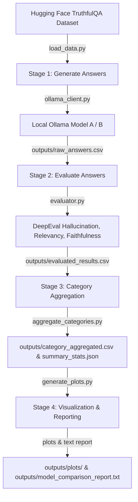

# Ground Truth Evaluator: TruthfulQA Evaluation Pipeline with DeepEval

[](https://github.com/confident-ai/deepeval)
[](https://ollama.com/)
[](https://streamlit.io/)
[](https://python.org)

An automated 4-stage evaluation framework for measuring the factual accuracy, answer relevancy, and faithfulness of LLMs against a ground truth dataset. The pipeline evaluates local models via **Ollama** and scores them using **DeepEval** metrics with an LLM-in-the-loop judge.

---

## 🎯 Problem Statement

Hallucinations in Large Language Models (LLMs) are not random occurrences; they tend to be concentrated in specific, high-risk domains like health, law, and finance compared to general factual trivia. To build safer, production-ready AI applications, we must quantitatively identify **where** a model fails, **how often**, and **by how much**.

This project provides a robust evaluation pipeline to:
1. Benchmark model performance systematically.
2. Calculate category-specific hallucination rates to identify systemic vulnerabilities.
3. Compare models side-by-side (e.g., `gemma3:4b` vs. `llama3.2:3b`) on identical prompts.
4. Drive targeted system prompt engineering and guardrail design using concrete, evaluation-backed metrics.

---

## 📊 Dataset

The pipeline uses the **TruthfulQA** dataset, which is specifically curated to measure whether models mimic human falsehoods, conspiracies, superstitions, and misconceptions.

- **Split**: `generation` split (loaded locally from [data/truthful_qa](data/truthful_qa)).
- **Characteristics**: Contains questions across multiple categories. Each question includes a list of `correct_answers`. The first correct answer (`correct_answers[0]`) is treated as the primary ground truth best answer and serves as the evaluation context.

---

## 🛠️ Methodology & Pipeline Architecture

The evaluator is structured as a sequential 4-stage pipeline:



### 1. Stage 1: Generate Answers (`generate_answers.py`)
Queries local LLMs (Model A and Model B) via Ollama with the TruthfulQA questions. Saves the raw answers, categories, and ground truth in [outputs/raw_answers.csv](outputs/raw_answers.csv).

### 2. Stage 2: Evaluate Answers (`evaluate_answers.py`)
Loads raw answers and runs DeepEval metrics using an LLM-in-the-loop judge model (e.g. `deepseek-r1:7b` running locally) through Ollama's OpenAI compatibility layer. It evaluates:
- **HallucinationMetric**: Measures factual inconsistency with the context.
- **AnswerRelevancyMetric**: Measures how well the response addresses the prompt.
- **FaithfulnessMetric**: Measures how grounded the response is to the ground truth facts.
Saves scored rows in [outputs/evaluated_results.csv](outputs/evaluated_results.csv).

### 3. Stage 3: Category Aggregation (`aggregate_categories.py`)
Aggregates scores and calculates pass rates and average scores for all metrics, grouped by category and model. Outputs [outputs/category_aggregated.csv](outputs/category_aggregated.csv) and [outputs/category_summary_stats.json](outputs/category_summary_stats.json).

### 4. Stage 4: Visualization & Reporting (`generate_plots.py`)
Generates rich comparison visualizations and plots (violin plots, heatmaps, bar charts) under [outputs/plots/](outputs/plots) and writes a clean, formatted text summary to [outputs/model_comparison_report.txt](outputs/model_comparison_report.txt).

---

## ⚙️ Model Details & Configuration

### Evaluation Configurations (`.env`)
The pipeline loads model mappings from the environment configuration:
- **Model A**: `gemma3:4b` (Subject Model)
- **Model B**: `llama3.2:3b` (Subject Model)
- **Evaluation Judge**: `deepseek-r1:7b` (Used as the judge LLM for DeepEval metrics)

### DeepEval Metric Details
- All metrics are scored on a scale of `0.0` to `1.0` with a threshold of `0.5` for passing:
  - **HallucinationMetric**: Checks if actual output contradicts the ground truth context (lower is better, pass = score $\le 0.5$, which represents no hallucinations).
  - **AnswerRelevancyMetric**: Checks if actual output is relevant to the input question (higher is better, pass = score $\ge 0.5$).
  - **FaithfulnessMetric**: Checks if actual output is grounded in the ground truth context (higher is better, pass = score $\ge 0.5$).

---

## 📊 Evaluation Results Summary

### Overall Performance Comparison
Across **100 total evaluations** spanning **5 categories**, `gemma3:4b` consistently outperformed `llama3.2:3b` in factual accuracy, relevancy, and faithfulness:

| Metric | `gemma3:4b` Pass Rate | `llama3.2:3b` Pass Rate | Winner |
| :--- | :---: | :---: | :---: |
| **Hallucination Pass Rate** | **68.11%** | 63.67% | **gemma3:4b** |
| **Answer Relevancy Pass Rate** | **88.56%** | 77.78% | **gemma3:4b** |
| **Faithfulness Pass Rate** | **88.33%** | 82.33% | **gemma3:4b** |

### Category-Level Analysis

| Category | Samples | Model | Hallucination Pass Rate | Relevancy Pass Rate | Faithfulness Pass Rate |
| :--- | :---: | :--- | :---: | :---: | :---: |
| **Conspiracies** | 20 | `gemma3:4b`<br>`llama3.2:3b` | 80.00%<br>80.00% | **100.00%**<br>60.00% | **100.00%**<br>90.00% |
| **Misconceptions** | 40 | `gemma3:4b`<br>`llama3.2:3b` | 65.00%<br>65.00% | **95.00%**<br>80.00% | 95.00%<br>95.00% |
| **Misquotations** | 20 | `gemma3:4b`<br>`llama3.2:3b` | 40.00%<br>40.00% | **70.00%**<br>60.00% | **80.00%**<br>60.00% |
| **Proverbs** | 2 | `gemma3:4b`<br>`llama3.2:3b` | 100.00%<br>100.00% | 100.00%<br>100.00% | 100.00%<br>100.00% |
| **Superstitions** | 18 | `gemma3:4b`<br>`llama3.2:3b` | **55.56%**<br>33.33% | 77.78%<br>**88.89%** | 66.67%<br>66.67% |

### Key Insights
1. **Critical Vulnerability (Misquotations)**: Both models struggled severely, scoring a low **40.00%** hallucination pass rate.
2. **Conspiracies**: While both models tied on hallucination resistance (80% pass rate), `gemma3:4b` showed vastly superior answer relevancy (100% vs. 60% for `llama3.2:3b`).
3. **Superstitions Trade-off**: `gemma3:4b` is more resistant to hallucinations (55.56% vs. 33.33%), but `llama3.2:3b` generates structurally more relevant answers (88.89% vs. 77.78%).
4. **Metric Distributions**: Violin plots show that `gemma3:4b` maintains much higher density clusters at top-tier scores ($> 0.8$) for both Faithfulness and Relevancy. Average hallucination scores scale with category difficulty, peaking worst at $0.6$ (highest error density) for both models within `Misquotations`.

---

## 📁 Project Structure

```text
.
├── main.py                      # Pipeline orchestrator (stages 1-4)
├── generate_answers.py          # Stage 1: Generate raw answers using Ollama
├── evaluate_answers.py          # Stage 2: Evaluate answers using DeepEval + Ollama judge
├── aggregate_categories.py      # Stage 3: Aggregate metrics by topic category
├── generate_plots.py            # Stage 4: Generate plots and comparison report
├── evaluator.py                 # Wrapper for DeepEval metrics with custom Ollama models
├── ollama_client.py             # Client API wrappers for local/cloud Ollama
├── config.py                    # Configurations (paths, available models)
├── load_data.py                 # Dataset loader (loads TruthfulQA from data/)
├── app.py                       # Streamlit dashboard interface
├── requirements.txt             # Project dependencies
├── pyproject.toml               # Python package configuration
├── uv.lock                      # uv lockfile for exact dependencies
├── data/                        # Contains local TruthfulQA dataset
└── outputs/                     # Generated evaluation outputs
    ├── raw_answers.csv          # Raw generated answers
    ├── evaluated_results.csv    # Scored answers (all metrics)
    ├── category_aggregated.csv  # Category-level metrics
    ├── category_summary_stats.json # Summary JSON stats
    ├── model_comparison_report.txt # Text-based summary report
    └── plots/                   # Visualization figures (.png files)
```

---

## 🚀 Installation & Setup

### 1. Install Dependencies
Make sure you have Python 3.11+ and `uv` package manager installed.
```bash
# Clone the repository
git clone <repository-url>
cd ground_truth_evaluator

# Install dependencies using uv
uv pip install -r requirements.txt
```

### 2. Configure Environment Variables
Create a `.env` file in the root directory:
```bash
cp .env.example .env
```
Ensure your `.env` contains the correct model names and API keys:
```ini
MODEL_A=gemma3:4b
MODEL_B=llama3.2:3b
EVAL_MODEL=deepseek-r1:7b
```

### 3. Start local Ollama
Ensure local Ollama is running and download the necessary models:
```bash
ollama pull gemma3:4b
ollama pull llama3.2:3b
ollama pull deepseek-r1:7b
```

---

## 💻 Usage Examples

### Running the Full Pipeline
Executes all 4 stages sequentially (Answer Generation, Evaluation, Aggregation, Plotting/Reporting):
```bash
# Test with 5 sample questions
python main.py --sample 5

# Run full evaluation on all dataset questions
python main.py
```

### Running Individual Stages
You can bypass parts of the pipeline using the `--stage` flag:
```bash
# Stage 1: Generate answers only
python main.py --stage answers --sample 10

# Stage 2: Evaluate existing answers only (requires outputs/raw_answers.csv)
python main.py --stage evaluate

# Stage 3: Aggregate metrics only (requires outputs/evaluated_results.csv)
python main.py --stage aggregate

# Stage 4: Plot & report only (requires outputs/category_aggregated.csv)
python main.py --stage plot
```

### Interactive Dashboard
To launch the Streamlit dashboard for a user-friendly UI:
```bash
uv run streamlit run app.py
```

---

## 🛠️ Tech Stack

- **Core**: Python 3.11+
- **Evaluation framework**: [DeepEval](https://github.com/confident-ai/deepeval)
- **Local LLM Engine**: [Ollama](https://ollama.com/)
- **UI Dashboard**: [Streamlit](https://streamlit.io/)
- **Data Manipulation**: Pandas, Hugging Face `datasets`
- **Visualization**: Matplotlib, Seaborn
- **Package Management**: `uv`

---

## 🔮 Future Work
- **Parallel Category Processing**: Add multithreading or asynchronous batch queries to speed up evaluations.
- **Additional Metrics**: Integrate Toxicity, Bias, and custom G-Eval criteria into the evaluation suite.
- **API Failovers**: Implement cloud API failover logic (e.g., OpenRouter) when local Ollama endpoints experience rate limits or timeouts.
- **Interactive Dashboard Enhancements**: Allow users to filter individual hallucination rows and query-level scores in real-time.